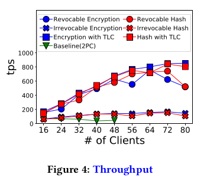
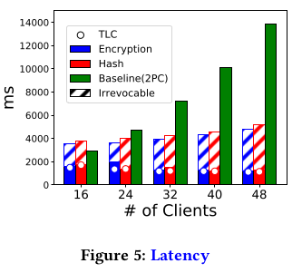
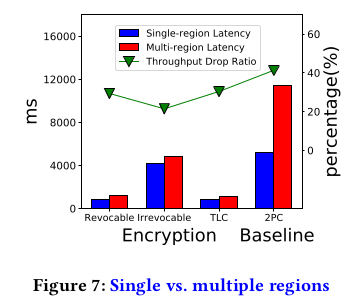
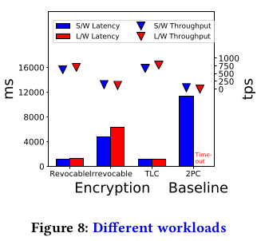
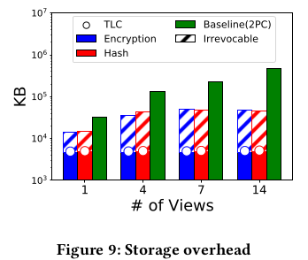
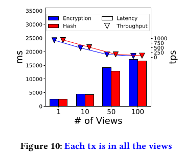
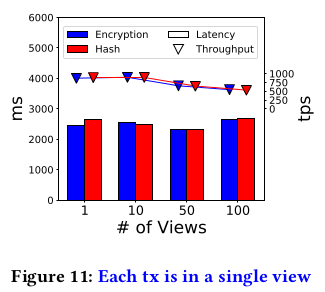
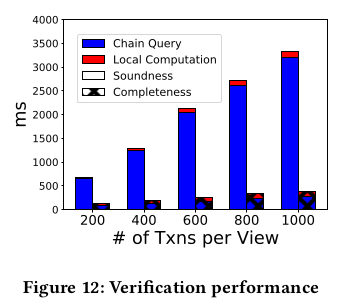
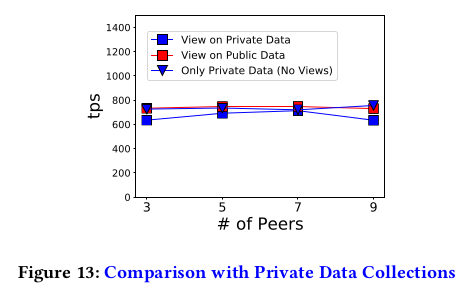

# Overview
The repository demonstrates the implementation of our proposal on the access-control views on blockchains.
And the guide also describes how to reproduces experiments on a Fabric network instance. 
It comprises two peers and a single orderer. 
Two peers are from distinct organizations. 
The instance is deployed Google Cloud Platform, spanning multiple global regions. 
We strongly advise readers to go through the Fabric official [doc](https://hyperledger-fabric.readthedocs.io/en/latest/test_network.html) first. 
With a foundation on Fabric, readers can better understand our guide. 
Below, we lay out the experimental setup, explain the project structure and relate our experimental results to their corresponding scripts. 

# Experimental Setup
Below setups only require to do once. 
## Setup GCP from a Local Machine
We test the below on our local ubuntu machine: 
* Install GCP [Commands](https://cloud.google.com/sdk/docs/scripting-gcloud)
* Create the GCP Network and Firewall by ` # Under gcp-network/; ./gcp.sh network_new `
* Create a `fabriccli` GCP client instance attached to the created network
```
# Under gcp-network/;
. ./env.sh
gcloud compute instances create fabriccli \
	--zone=asia-southeast1-a \
	--machine-type=e2-standard-16 \
	--network=${GCP_NETWORK} \
    --image-project=ubuntu-os-cloud \
    --image-family=ubuntu-1804-lts  \
	--quiet
```

## Setup Client Instance
* Connect to the instance: ` gcloud compute ssh --zone=asia-southeast1-a fabriccli `
* Log in with the GCP account: `gcloud auth login`
* Install below dependencies: 

```bash
$ sudo apt-get install build-essential

$ go version
go version go1.13.9 linux/amd64

$ node --version
v13.13.0

$ npm --version
6.14.4

$ docker-compose --version
docker-compose version 1.29.2, build 5becea4c

$ docker --version
Docker version 20.10.12, build e91ed57

```

* Clone this repo
* Install Fabric
```
# Under repo root directory
fabric_version="2.2.4"
ca_version="1.5.2"

# According to https://hyperledger-fabric.readthedocs.io/en/release-2.2/install.html,
#   the script will download vendor-specific fabric binaries and docker images
#   Can inspect downloaded docker images with `docker images |grep hyperledger`
curl -sSL https://bit.ly/2ysbOFE | bash -s -- ${fabric_version} ${ca_version}

# Pull out bin/ with binaries and config/ with config files
cp -r fabric-samples/bin . 
cp -r fabric-samples/config . 

# Make binaries accessible on $PATH
export PATH="$(pwd)/bin:${PATH}"

# Install front end
npm install
```
__NOTE__: Hereafter all commands and scripts are running on the client instance. 

# Project Structure
## [gcp-network/](gcp-network/) 
The directory contains artifacts and scripts to manage the GCP instance, Fabric instance, including spinning up, turning down, creating channels, deploying contracts(chaincodes), and etc. 
They are utilized in later-mentioned experimental bash scripts. 

Example usage: 
```
# Under gcp-network/

# Create GCP instances for Fabric to run
export PEER_COUNT=2
./gcp.sh instance_up

# Spin up Fabric
./network.sh up

# Create Channel
CHANNEL_NAME="viewchannel"
./network.sh createChannel -c ${CHANNEL_NAME}

# See below on Contract Deployment

#Turn down Fabric
./network.sh down

# Turn down GCP instances
./gcp.sh instance_down
```


## [chaincodes/](chaincodes)
The directory contains smart contracts (chaincodes) to be deployed on Fabric. 

* [txncoordinator.go](chaincodes/txncoordinator/txncoordinator.go): a smart contract that coordinates the cross-chain Two-phase Commit. 
* [viewstorage.go](chaincodes/viewstorage/viewstorage.go): a smart contract to store the view data, exclusive for Irrevocable views. 

The below contracts share a common function with signature `InvokeTxn(ctx contractapi.TransactionContextInterface, pub_arg, private_arg string)`.
This is the execution entry for workload transactions, i.e., the supply chain. The `pub_arg` is for the non-secret part of a transaction, whereas `private_arg` for the processed secret part. The secret part is either hash-hidden, encryption-hidden, or plain without any protection.

* [noop.go](chaincodes/noop/noop.go): a smart contract that performs no data processing, used to evaluate the Fabric's raw throughput. 
* [onchainview.go](chaincodes/onchainview/onchainview.go): a smart contract that implements the paper-mentioned _ViewInContract_ for the supply chain workload. A transaction's processed secret part is stored as the __Fabric Public Data__. 
* [privateonchainview.go](chaincodes/privateonchainview/privateonchainview.go): a smart contract that implements the paper-mentioned _ViewInContract_ for the supply chain workload. A transaction's processed secret part is stored as the __Fabric Private Data__. 
* [secretcontract.go](chaincodes/secretcontract/secretcontract.go): a smart contract for the supply chain workload only, without in-contract access-controlled views. The transaction's secret part is stored as the __Fabric Public Data__. 
* [privateonly.go](chaincodes/privateonly/privateonly.go): a smart contract for the supply chain workload only, without in-contract access-controlled views. The transaction's secret part is stored as the __Fabric Private Data__. 

### Scripts to Deploy a Contract(Chaincode)
```
# Under gcp-network/
CC_NAME="noop" # Can also be txncoordinator, privateonly, ..., etc.

export PEER_COUNT=2
ALL_ORG=""
for i in $(seq ${PEER_COUNT})
do
   ALL_ORG="$ALL_ORG 'Org${i}MSP.peer'"
done

function join_by { local d=$1; shift; local f=$1; shift; printf %s "$f" "${@/#/$d}"; }

ENDORSE_POLICY="OR($(join_by , $ALL_ORG))" # Result into "OR(Org1MSP.peer,Org2MSP.peer)"

./network.sh deployCC -c ${CHANNEL_NAME} -ccl go -ccn ${CC_NAME} -ccp ../chaincodes/${CC_NAME} -ccep ${ENDORSE_POLICY} -cccg ../chaincodes/${CC_NAME}/collection_config.json
```
## [app/](app/)
The directory contains NodeJS codes that implement the access-controlled views on blockchains. They are : 
* [crypto_mgr.js](app/crypto_mgr.js): a module with cryptographic primitives, such as hash operations, asymmetric encryptions, and etc. 
* [fabric_front.js](app/fabricfront.js): a module that interacts with contracts in Fabric instance. 
* [front_demo.js](app/front_demo.js): a demo that showcases `front_front`'s interaction with Fabric instance
   * Assume the Fabric instance on GCP is on, the channel named `viewchannel` is created and the contract `noop.go` is deployed. 
* [global.js](app/global.js): a module that groups all global variables. 

The above modules provide low-level operations for below modules. For example, `encryption_based_view_mgr` requires `fabric_front` to interact with Fabric instance. 
* [encryption_based_view_mgr.js](app/encryption_based_view_mgr.js): a module that implements Encryption-based views. 
	* It supports `Revocable`, `Irrevocable`, and `ViewInContract` modes, all of which the paper has discussed. The `ViewInContract` mode is what the paper described as `TxListContract`. 
* [hash_based_view_mgr.js](app/hash_based_view_mgr.js): a module that implements Hash-based views. It supports `Revocable`, `Irrevocable`, and `ViewInContract` modes. 
* [plain_view_mgr.js](app/plain_view_mgr.js): a module that does not hide the transaction's secret part and directly invoke the transaction with the uncovered secret part. 
	* The uncovered secret part may be protected by Fabric built-in Private Data. 
	* It supports `ViewInContract` and `OnlyWorkload`  mode. In `OnlyWorkload`  mode, the module skips all view manipulations, such as view creation or appending operations. It is to measure the workload throughput solely, without incurring view management overheads. 
* [view_demo.js](app/view_demo.js): a demo that showcases a complete management lifecycle of an Encryption-based View with `Revocable` mode. The view involves a single transaction. The demo also comments how to work with other view schemes or modes. 
	* The demo assumes the Fabric instance on GCP is on, the channel named `viewchannel` is created and the contracts `noop.go`, `viewstorage`, `onchainview` and `privateonchainview` are deployed. 
	* The demo script also illustrates how to edit codes and switch to other modes.

## [exp/](exp/)
The directory contains logs, results, workloads, scripts for experiments. 
Scripts are a mix of NodeJS scripts and bash scripts. 

### Workloads
* [small_batch_workload.py](exp/workload/small_batch_workload.py): the generator for a small-scale supplychain workload
* [small_100items_25batchsize.json](exp/workload/small_100items_25batchsize.json): the small-scale supplychain workload
	* Generated by cmd `python small_batch_workload.py 100 25`
* [large_batch_workload.py](exp/workload/large_batch_workload.py): the generator for a large-scale supplychain workload
* [large_100items_25batchsize.json](exp/workload/large_100items_25batchsize.json): the large-scale supplychain workload
	* Generated by cmd `python large_batch_workload.py 100 25`

### NodeJS Scripts
A NodeJS script constitutes a client driver, which a bash script invokes to launch into a number of client processes.  The NodeJS scripts builds upon the modules in [app/](app/). 
* [ledger_storage.js](exp/ledger_storage.js): a script to measure the chain storage size in bytes. 
* [perf_viewincontract.js](exp/perf_viewincontract.js): a script to measure `ViewInContract`-mode performance with varying numbers of views and transaction selectivity. There are two options in selectivityy. If _ALL_, a transaction falls into all views. If _single_, it falls into a random view. 
* [two_phase_mgr.js](exp/two_phase_mgr.js): a script that commits a request with Two-phase Commit across multiple involved chains. 
* [supplychain_2pc.js](exp/supplychain_2pc.js): a script that runs the supply chain workload with the baseline two-phase-commit approach, as coded in `two_phase_mgr`. 
* [supplychain_view.js](exp/supplychain_view.js): a script that runs the supply chain workload with access controlled views, with configurable schemes (Encryption/Hash) and modes(Revocable/Irrevocable/ViewInContract). 
* [verify_viewincontract.js](exp/verify_viewincontract.js): a script that measures delays for verifying a view's soundness and completeness. 

### Bash Scripts
Each bash script performs an end-to-end experiment. They share a common pattern --- firstly spin up the network, then create the channel, deploy required contracts,  launch multiple client processes from a NodeJS script, aggregates results from clients, and turns down the network. In the next section, we relate each experimental charts to bash scripts that derive the chart figures. 

### Log and Result Venue
For each experimental run, the aggregated results and the logs of all client processes are persisted under the date-named subdirectory of [exp/result](exp/result) and [exp/log](exp/log) respectively. The results and log files are named with unique identifiers determined from experimental parameters. 

# From Experimental Results to Bash Scripts
 * Below mentioned commands run at `exp/` as the working directory. 
 * We assume GCP instances have been created by `export PEER_COUNT=2; ./gcp.sh instance_up`
## Throughput

* Figures other than _Baseline(2PC)_ are collected from _Total Thruput(tps)_ field from aggregated result files, generated by the command 
```
for c in 16 24 32 40 48 56 64 72 80 ; do
	./view_perf_end2end.sh workload/small_100items_25batchsize.json $c
done
```

* Figures of _Baseline(2PC)_ are collected from _Total Thruput(tps)_ field from each aggregated result files, generated by the command 
```
for c in 16 24 32 40 48 56 64 72 80 ; do
	./2pc_perf_end2end.sh.sh workload/small_100items_25batchsize.json $c
done
```


## Latency

* Figures other than _Baseline(2PC)_ are collected from _Batch Delay(ms)_ field from aggregated result files, generated by the command 
```
for c in 16 24 32 40 48 ; do
	./view_perf_end2end.sh workload/small_100items_25batchsize.json $c
done
```

* Figures of _Baseline(2PC)_ are collected from _Batch Delay(ms)_ field from each aggregated result files, generated by the command 
```
for c in 16 24 32 40 48 ; do
	./2pc_perf_end2end.sh.sh workload/small_100items_25batchsize.json $c
done
```

## Single-region vs Multi-region Performance 

* Throughputs and latencies of the multi-region are similarly collected like above from the command
```
./view_perf_end2end.sh workload/small_100items_25batchsize.json 48
./2pc_perf_end2end.sh.sh workload/small_100items_25batchsize.json 48
```

* For the single-region figures, need to override the region configuration, recreate the instances, and then repeat the experiment. 
```
# Under gcp-network/ 
./gcp.sh instance_down
export SINGLE_REGION=1
./gcp.sh instance_up

# Under exp/
./view_perf_end2end.sh workload/small_100items_25batchsize.json 48
./2pc_perf_end2end.sh.sh workload/small_100items_25batchsize.json 48

# Under gcp-network/ 
./gcp.sh instance_down
unset SINGLE_REGION
./gcp.sh instance_up
```

## Performance related to Workloads

* Throughputs and latencies of the large workload are collected from the command
```
./view_perf_end2end.sh workload/large_100items_25batchsize.json 48
./2pc_perf_end2end.sh.sh workload/large_100items_25batchsize.json 48
```

* Throughputs and latencies of the small workload are collected from the command
```
./view_perf_end2end.sh workload/small_100items_25batchsize.json 48
./2pc_perf_end2end.sh.sh workload/small_100items_25batchsize.json 48
```

## Storage

* Figures other than _Baseline(2PC)_ are collected from _Ledger Size (Bytes):_ field of the aggregated result files, generated from the command 
```
./view_storage.sh workload/small_100items_25batchsize.json 4
```

* Figures of _Baseline(2PC)_ are collected from _Ledger Size (Bytes):_ field of the aggregated result files, generated from command 
  * The final result is computed by multipling the reported single-chain size with the supposed number of views/chains. 
```
./2pc_storage.sh workload/small_100items_25batchsize.json 4
```


## Performance of ViewInContract mode
### Selectivity : ALL


Throughputs and latencies are similarly collected like above, but from result files generated by command 
```
./viewincontract_perf.sh 1 all 48
./viewincontract_perf.sh 10 all 48
./viewincontract_perf.sh 50 all 48
./viewincontract_perf.sh 100 all 32
```

### Selectivity : SINGLE


Throughputs and latencies are similarly collected like above, but from result files generated by command
```
./viewincontract_perf.sh 1 single 48
./viewincontract_perf.sh 10 single 48
./viewincontract_perf.sh 50 single 32
./viewincontract_perf.sh 100 single 32
```

## Latency of View Verification


Run command `./verify_viewincontract.sh` under the single-region setup. 
In each generated result file, last few lines are like: 
* Scan $A$ $B$-batch transactions in $C$ ms ( remote query in $D$ ms, verify in $E$ ms )
* Scan $E$ blocks in $F$ ms ( remote query in $G$ ms, verify in $H$ ms ) 

Figures in the chart are collected as below: $D$ and $E$ respectively stand for _Chain Query_ and _Local Computation_ of _Soundness_, whereas $G$ and $H$ for _Completeness_'s _Chain Query_ and _Local Computation_.

## Throughputs with Varying Number of Peers


Need to create 9 peer instances:
```
# under gcp-network/
./gcp.sh instance_down
export PEER_COUNT=9; 
./gcp.sh instance_up
```

Running command: 
```
./view_scalability.sh workload/small_100items_25batchsize.json 3 
./view_scalability.sh workload/small_100items_25batchsize.json 5
./view_scalability.sh workload/small_100items_25batchsize.json 7
./view_scalability.sh workload/small_100items_25batchsize.json 9
```

With respect to ths script and the chart, 
* The results from `run_exp ${workload_file}  "${ENCRYPTION_SCHEME}" "onchainview" ${peer_count}` corresponds to _View On Public Data_ curve. 
* The results from `run_exp ${workload_file} "${PLAIN_SCHEME}" "privateonchainview" ${peer_count}` corresponds to _View On Private Data_ curve. 
* The results from `run_exp ${workload_file} "${PLAIN_SCHEME}" "privateonly" ${peer_count}` corresponds to _Only Private Data (No Views)_ curve. 

# Clean down
```
# Under gcp-network/ of the client GCP instance
./gcp.sh instance_down 

# Delete client instance
gcloud compute instances delete fabriccli

# Under gcp-network/ of the local machine
./gcp.sh network_delete
```